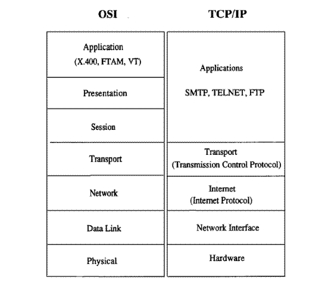

# # 基本概念

## 为什么会有TCP/IP协议

在世界上各地，各种各样的电脑运行着各自不同的操作系统为大家服务，这些电脑在表达同一种信息的时候所使用的方法是千差万别。就好像圣经中上帝打乱了各地人的口音，让他们无法合作一样。计算机使用者意识到，计算机只是单兵作战并不会发挥太大的作用。只有把它们联合起来，电脑才会发挥出它最大的潜力。于是人们就想方设法的用**电线**把电脑连接到了一起。

但是简单的连到一起是远远不够的，就好像语言不同的两个人互相见了面，完全不能交流信息。因而他们需要**定义一些共通的东西**来进行**交流**，TCP/IP就是为此而生。TCP/IP不是一个协议，而是一个**协议族**的统称。里面包括了IP协议，IMCP协议，TCP协议，以及我们更加熟悉的http、ftp、pop3协议等等。电脑有了这些，就好像学会了外语一样，就可以和其他的计算机终端做**自由的交流**了。

## TCP/IP协议分层

提到协议分层，我们很容易联想到ISO-OSI的七层协议经典架构，但是TCP/IP协议族的结构则稍有不同。

TCP/IP协议族按照层次由上到下，层层包装。

最上面的就是**应用层**了，这里面有http，ftp等等我们熟悉的协议。

第二层则是**传输层**，著名的TCP和UDP协议就在这个层次（不要告诉我你没用过udp玩星际）。

第三层是**网络层**，IP协议就在这里，它负责对数据加上IP地址和其他的数据（后面会讲到）以确定传输的目标。

第四层是叫**数据链路层**，这个层次为待传送的数据加入一个以太网协议头，并进行CRC编码，为最后的数据传输做准备。

再往下则是**硬件层次**了，负责网络的传输，这个层次的定义包括网线的制式，网卡的定义等等（这些我们就不用关心了，我们也不做网卡），所以有些书并不把这个层次放在tcp/ip协议族里面，因为它几乎和tcp/ip协议的编写者没有任何的关系。

发送协议的主机**从上自下**将数据按照协议封装，而接收数据的主机则按照协议从得到的数据包解开，最后拿到需要的数据。这种结构非常有**栈**的味道，所以某些文章也把tcp/ip协议族称为tcp/ip协议栈。

## 一些基本的常识

在学习协议之前，我们应该具备一些基本知识。

### 互联网地址（IP地址）

**网络上每一个节点**都必须有一个独立的Internet地址（也叫做IP地址）。现在，通常使用的IP地址是一个32bit的数字，也就是我们常说的IPv4标准，这32bit的数字分成四组，也就是常见的255.255.255.255的样式。IPv4标准上，地址被分为五类，我们常用的是B类地址。具体的分类请参考其他文档。需要注意的是IP地址是网络号+主机号的组合，这非常重要。

### 域名系统

域名系统是一个分布的数据库，它提供将主机名（就是网址啦）转换成IP地址的服务。

### RFC

RFC是什么？RFC就是tcp/ip协议的标准文档，在这里我们可以看到RFC那长长的定义列表，现在它一共有4000多个协议的定义，当然，我们所要学习的，也就是那么十几个协议而已。

### 端口号(port)

注意，这个号码是用在TCP，UDP上的一个逻辑号码，并不是一个硬件端口，我们平时说把某某端口封掉了，也只是**在IP层次把带有这个号码的IP包给过滤掉了**而已。

### 应用编程接口

现在常用的编程接口有socket和TLI。而前面的有时候也叫做“Berkeley socket”，可见Berkeley对于网络的发展有多大的贡献。

