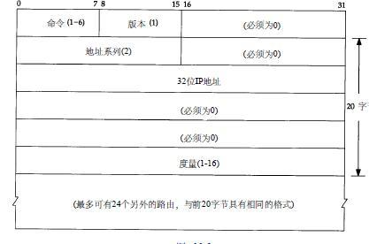

## 静态IP选路

### 一个简单的路由表

选路是IP层最重要的一个功能之一。前面的部分已经简单的讲过路由器是通过何种规则来根据IP数据包的IP地址来选择路由。这里就不重复了。首先来看看一个简单的系统路由表。

对于一个给定的路由器，可以打印出五种不同的flag。

* U表明该路由可用。

* G表明该路由是到一个网关。如果没有这个标志，说明和Destination是直连的，而相应的**Gateway**应该直接给出Destination的地址。

* H表明该路由是到一个主机，如果没有该标志，说明Destination是一个网络，换句话说Destination就应该写成一个网络号和子网号的组合，而不包括主机号(主机号码处为0)，例如 192.168.11.0

* D表明该路由是为重定向报文创建的。

* M该路由已经被重定向报文修改。

U没啥可说的，G说明这是一个网关，如果你要发数据给Destination，IP头应该写Destination的IP地址，而数据链路层的MAC地址就应该是GateWay的Mac地址了；反之，如果没有G标志，那么数据链路层和IP层的地址应该是对应的。H说明了Destination的性质，如果是H的，则说明该地址是一个完整的地址，既有网络号又有主机号，那么再匹配的时候就既要匹配网络号，又要匹配主机号；反之，Destination就代表一个网络，在匹配的时候只要匹配一下网络号就可以了。

这样，IP选路的方式就可以更加具体化了。如下

1. 首先用IP地址来匹配那些带H标志的DestinationIP地址。
1. 如果1失败就匹配那些网络地址。
1. 如果2失败就发送到Default网关

顺便提一下那个GenMask（还记得子网掩码么），它指定了目的地址的子网号，例如第一条的子网就是11。

### 其他有关路由表的知识

一般，我们在配置好一个网络接口的时候，一个路由就被直接创建好了。当然我们也可以手动添加路由。用route add命令就可以了。

而当一个IP包在某一个路由器的时候发现没有路由可走，那么该路由器就会给源主机发送“主机不可达”或者“网络不可达”的ICMP包来报错。

注意，一般的操作系统默认是没有路由功能的，这需要自己配置。这些历史原因就不细说了。

### ICMP的IP重定向报文和路由发现报文

当IP包在某一个地方转向的时候，都回给发送IP报的源主机一个ICMP重定向报文，而源主机就可以利用这个信息来更新自己的路由表，这样，随着网络通信的逐渐增多，路由表也就越来越完备，数据转发的速度也会越来越快。我们需要注意的是：

1. 重定向报文只能由路由器发出。
1. 重定向报文为主机所用，而不是为路由器所用。
1. 在主机引导的时候，一般会发送在网内广播一个路由请求的ICMP报文，而多个路由器则会回应一个路由通告报文。而且，路由其本身不定期的在网络内发布路由通告报文，这样，根据这些报文，每一个主机都会有机会建立自己的路由表而实现网络通信。路由器在一份通告报文中可以通告多个地址，并且给出每一个地址的优先等级，这个优先等级是该IP作为默认路由的等级，至于怎么算的就不深究了。

路由器一般会在450-600秒的时间间隔内发布一次通告，而一个给定的通告报文的寿命是30分钟。而主机在引导的时候会每三秒发送一次请求报文，一旦接受到一个有效的通告报文，就停止发送请求报文。

在TCP/IP详解编写的时候，只有Solaris2.x支持这两种报文，大多数系统还不支持这两种报文。（后面还会讲到一些有用的路由报文）

## 动态选路协议

前面的选路方法叫做静态选路，简要地说就是在配置接口的时候，以默认的方式生成路由表项。并通过route来增加表项，或者通过ICMP报文来更新表项（通常在默认方式出错的情况下）。 而如果上诉三种方法都不能满足，那么我们就使用动态选路。

动态选路协议是用于动态选路的重要组成部分，但是他们只是使用在路由器之间，相邻路由器之间互相通信。系统（路有选择程序）选择比较合适的路有放到核心路由表中，然后系统就可以根据这个核心路有表找到最合适的网路。也就是说，动态选路是在系统核心网络外部进行的，它只是用一些选路的策略影响路由表，而不会影响到最后通过路由表选择路由的那一部分。选路协议有一大类常用的叫做内部网关协议(IGP)，而在IGP中，RIP就是其中最重要的协议。一种新的IGP协议叫做开放最短路经优先(OSPF)协议，其意在取代RIP。另一种最早用在网路骨干网上的IGP协议--HELLO，现在已经不用了。

如今，任何支持动态选路的路由器都必须同时支持OSPF和RIP，还可以选择性的支持其他的IGP协议。

### Unix选路程序

Unix系统上面通常都有路由守护程序－－routed。还有一个叫做gate。gate所支持的协议要比routed多，routed只是支持RIPv1版本。而gate则支持RIPv1、v2，BGPv1 等等。

### RIP：选路信息协议

它的定义可以在RFC1058内找到，这种协议使用UDP作为载体（也就是UDP的上层协议）。我们最关心的就是RIP其中的一个段，叫做度量的段，这是一个以hop作为计数器（就是以走过多少路由为计数器）的段（IP协议里面也有一个TTL不是么）。这个度量段将最终影响到路由表的建立。参考图:

一般说来routed要承担如下的工作：

1. 给每一个已知的路由器发送rip请求报文，要求其他路由器给出完整的路由表。这种报文的命令字段为1，地址字段为0，度量地段为16（相当于无穷大）。

1. 接受请求，如果接收到刚才的那个请求，就把自己的完整的路由表交给请求者。如果没有，就处理IP请求表项，把表项中自己有的部分添上跳数，没有的部分添上16。然后发给请求者。

1. 接受回应。更新自己的路由表。使用hop数小的规则。

1. 定期更新路由表，一般是30s(真频繁)给相邻的路有启发一次自己的路由表。这种形式可以使广播形式的。

这个协议看起来会工作的很好，但是，这里面其实有很多隐藏的忧患，比如说RIP没有子网的概念，比如说环路的危险。而且hop数的上限也限制了网络的大小。

因此，出现了很多RIPv1的替代品，比如说RIPv2,比如说OSPF。他们都是通过某种策略来影响路由表，所以就不说了。

